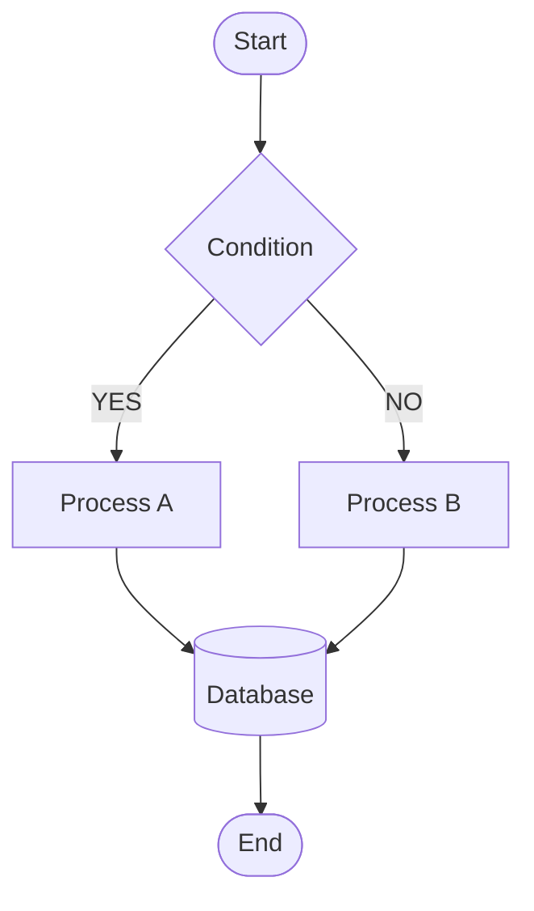
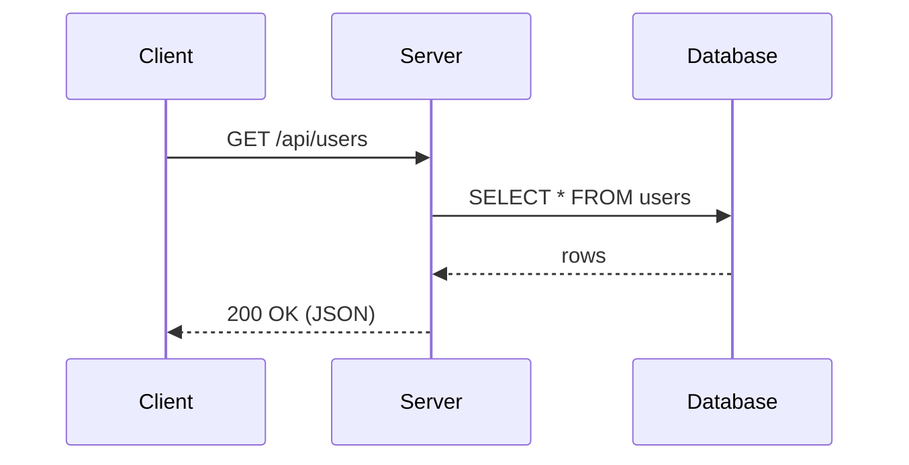
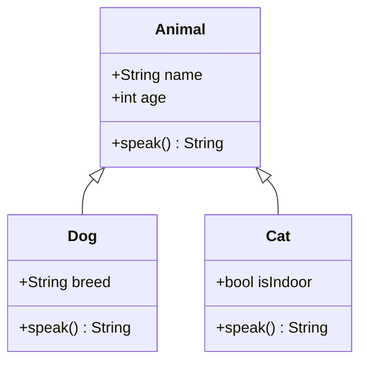
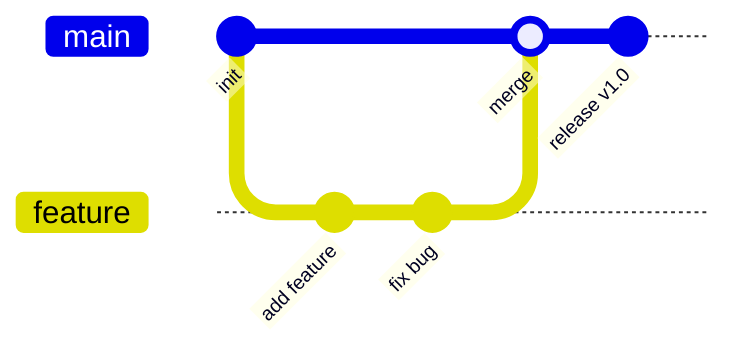
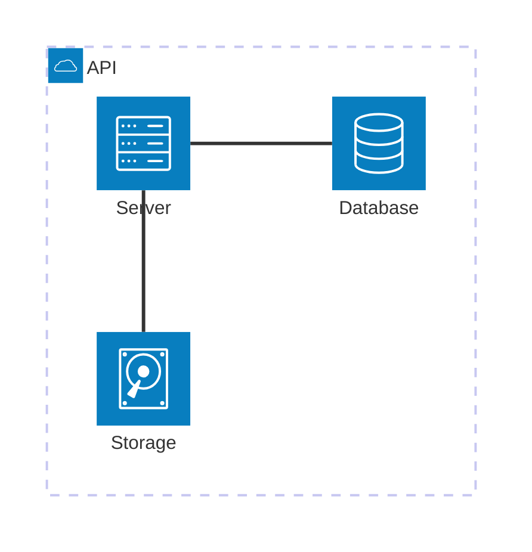

# Markdown All-Elements Test

## Headings

# H1 Heading
## H2 Heading
### H3 Heading
#### H4 Heading
##### H5 Heading
###### H6 Heading

---

## Paragraphs & Text Decoration

A normal paragraph of text. Lorem ipsum dolor sit amet, consectetur adipiscing elit.

**Bold text** *italic* ***bold italic***

~~strikethrough~~ `inline code`

<u>underline</u> <mark>highlight</mark> <small>small text</small>

Superscript: X<sup>2</sup> Subscript: H<sub>2</sub>O

---

## Lists

### Bulleted

- Item A
- Item B
  - Nested B-1
  - Nested B-2
    - Deeply nested B-2-a
- Item C

### Numbered

1. First item
2. Second item
   1. Nested 2-1
   2. Nested 2-2
3. Third item

### Task List

- [x] Completed task
- [x] Also completed
- [ ] Incomplete task
- [ ] Another incomplete task

---

## Links

[External link (to Google)](https://www.google.com)

[Link with title](https://www.example.com "Link to example.com")

<https://www.autolink-example.com>

<email@example.com>

---

## Images


---

## Blockquotes

> A single-line quote.

> A quote spanning multiple lines.
> Second line.
> Third line.

> Nested quote
> > Inner quote
> > > Even deeper quote

---

## Code Blocks

### Indented code

    function hello() {
        return "world";
    }

### Fenced code (no language)

```
plain text code block
no syntax highlighting
```

### JavaScript

```javascript
function fibonacci(n) {
    if (n <= 1) return n;
    return fibonacci(n - 1) + fibonacci(n - 2);
}

const result = fibonacci(10);
console.log(`Result: ${result}`);
```

### Python

```python
def quicksort(arr):
    if len(arr) <= 1:
        return arr
    pivot = arr[len(arr) // 2]
    left = [x for x in arr if x < pivot]
    mid  = [x for x in arr if x == pivot]
    right = [x for x in arr if x > pivot]
    return quicksort(left) + mid + quicksort(right)

print(quicksort([3, 6, 8, 10, 1, 2, 1]))
```

### Swift

```swift
struct Stack<T> {
    private var elements: [T] = []

    mutating func push(_ element: T) {
        elements.append(element)
    }

    mutating func pop() -> T? {
        elements.popLast()
    }

    var top: T? { elements.last }
}
```

### Shell

```bash
#!/bin/bash
for file in *.md; do
    echo "Processing: $file"
    wc -l "$file"
done
```

### SQL

```sql
SELECT u.name, COUNT(o.id) AS order_count
FROM users u
LEFT JOIN orders o ON u.id = o.user_id
WHERE u.created_at >= '2024-01-01'
GROUP BY u.id, u.name
ORDER BY order_count DESC
LIMIT 10;
```

---

## Tables

### Basic table

| Column A | Column B | Column C |
|----------|----------|----------|
| Value 1  | Value 2  | Value 3  |
| Value 4  | Value 5  | Value 6  |
| Value 7  | Value 8  | Value 9  |

### Alignment

| Left   | Center   | Right |
|:-------|:--------:|------:|
| Apple  | Orange   | 100   |
| Banana | Grape    | 2500  |
| Cherry | Mango    | 38    |

### Long table

| No. | Name  | Role         | Language      | Notes                        |
|----:|:------|:-------------|:--------------|:-----------------------------|
|   1 | Alice | Frontend     | TypeScript    | Strong with React            |
|   2 | Bob   | Backend      | Go            | Owns microservices           |
|   3 | Carol | Infra        | Bash / Python | Manages Kubernetes           |
|   4 | Dave  | Data analyst | Python / R    | Builds machine-learning models |

---

## Math (KaTeX)

### Inline math

Euler's identity: $e^{i\pi} + 1 = 0$

Quadratic formula: $x = \dfrac{-b \pm \sqrt{b^2 - 4ac}}{2a}$

### Block math

$$
\int_{-\infty}^{\infty} e^{-x^2} dx = \sqrt{\pi}
$$

$$
\mathbf{F} = m\mathbf{a} = m\frac{d^2\mathbf{r}}{dt^2}
$$

$$
\sum_{n=1}^{\infty} \frac{1}{n^2} = \frac{\pi^2}{6}
$$

$$
\begin{pmatrix}
a & b \\
c & d
\end{pmatrix}
\begin{pmatrix}
x \\
y
\end{pmatrix}
=
\begin{pmatrix}
ax + by \\
cx + dy
\end{pmatrix}
$$

---

## Mermaid Diagrams

### Flowchart



### Sequence diagram



### Class diagram



### Git graph



### Architecture (Mermaid 11+ only)

This `architecture-beta` diagram was introduced in Mermaid 11.1 and fails to
render on Mermaid 10 — a compatibility check for the bundled version.



---

## Horizontal Rules

---

***

___

---

## HTML Tags (inline)

<details>
<summary>Click to expand</summary>

This content is collapsed.

- Item 1
- Item 2

</details>

<br>

Text after a line break.

<div style="color: steelblue; font-weight: bold;">Colored text (div)</div>

---

## Footnotes

You can add a footnote[^1] in the body text. Multiple footnotes[^2] are supported too.

[^1]: This is the first footnote.
[^2]: This is the second footnote. It can contain a longer explanation.

---

## Definition List (extended)

Term A
: Description of term A.

Term B
: First description of term B.
: Second description of term B.

---

## Escaping

\*escaped asterisks\* \`escaped backticks\` \[escaped brackets\]

---

## Long Text (word-wrap test)

Lorem ipsum dolor sit amet, consectetur adipiscing elit, sed do eiusmod tempor incididunt ut labore et dolore magna aliqua. Ut enim ad minim veniam, quis nostrud exercitation ullamco laboris nisi ut aliquip ex ea commodo consequat. Duis aute irure dolor in reprehenderit in voluptate velit esse cillum dolore eu fugiat nulla pariatur.

The quick brown fox jumps over the lazy dog. Pack my box with five dozen liquor jugs. How valiantly did Bez jot down my quack fox jumping over the wig.

---

*End of all-elements test.*
